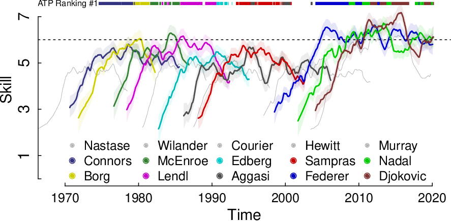
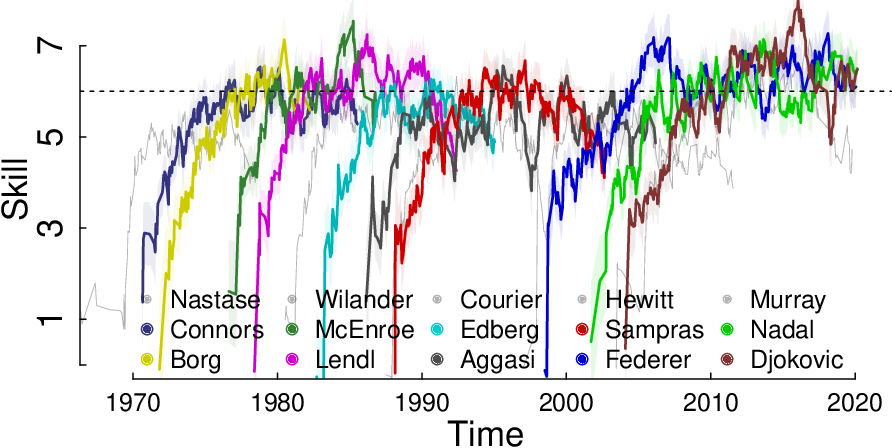

## TrueSkill Through Time: the Julia, Python and R packages.

Humans develop complex skills through time.
Estimating them is essential in education, labor and sports systems.
However, it is a sensitive issue when they are intended to be used to make decisions that may impact individuals.

None of the widely used skill estimators, such as TrueSkill, Glicko and Item-Response Theory, correctly models the temporal aspect, which prevents having both good initial estimates and comparability between estimates separated in time and space.

TrueSkill Through Time corrects those biases by modeling the entire history of activities using a single Bayesian network.
The use of an efficient algorithm, that requires only a few linear iterations over the data, allows scaling to millions of observations in few seconds.

In this paper we offer the first packages for `Julia`, `Python`, `R`, together with its scientific documentation, supporting the use of a reliable learning curve estimators.

### Scientific article

You can find the full scientific documentation of TrueSkill Through Time packages at:

0.  [English version](https://github.com/glandfried/TrueSkillThroughTime/releases/download/doc.0.0.0/article-en.pdf)

0.  [Versión en español](https://github.com/glandfried/TrueSkillThroughTime/releases/download/doc.0.0.0/article-es.pdf)

### Packages

0. Julia Package: [https://github.com/glandfried/TrueSkillThroughTime.jl](https://github.com/glandfried/TrueSkillThroughTime.jl)
0. Python Package: [https://github.com/glandfried/TrueSkillThroughTime.py](https://github.com/glandfried/TrueSkillThroughTime.py)
0. R package: [https://github.com/glandfried/TrueSkillThroughTime.R](https://github.com/glandfried/TrueSkillThroughTime.R)

### The History of the ATP

The following figure presents **the learning curves of some famous players in ATP history**.

Those who know the history of tennis will be able to recognize the periods of crisis, stability and success of the players.

There is a relative coincidence between skill and who is at any given moment at the top of the ATP rankings, it is possible to observe the effects of injuries, and even the effect of emotional slumps such as those that Aggasi and Djockovic had.

It is interesting to see that the skill of tennis players did not increase so much over the years: on the contrary the players of the 1980s were more skilled than those of the 1990s, and reached a skill similar to what Federer, Nadal and Djokovic had in 2020.

The 10th player in the historical ATP rankings, Hewitt, is only a product of the window of opportunity that was opened in the year 2000; and the 4th most skilled player, Murray, is ranked 14th just above Nastase.

The **models commonly used in industry and academia** (TrueSkill, Glicko, Item-Response Theory) are based on an ad-hoc solution that prevents them both from having good initial estimates and from guaranteeing comparability between estimates separated in time.

The advantage of TrueSkill Through Time lies in its temporal causal model, that links all historical activities in the same Bayesian network, which guarantees both good initial estimates and the temporal and spatial comparability of the estimates.
We have shown that this procedure converges quickly even on large databases.

With this article we promote their adoption by providing the first packages for Julia, Python and R, together with the complete scientific documentation.

